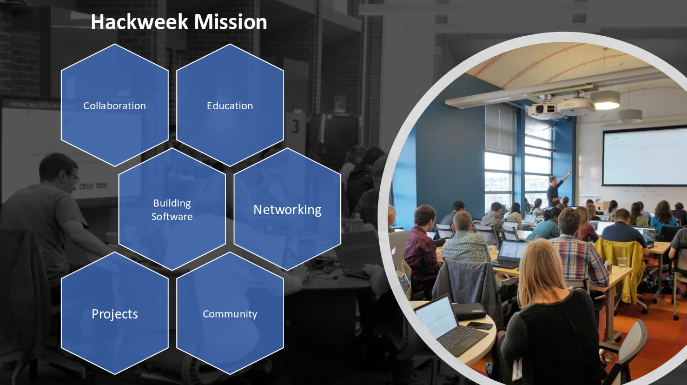

# Overview

## What is a hackweek?

The hackweek model has emerged within the data science community as a powerful tool for fostering exchange of ideas in research and computation by providing training in modern data analysis workflows. In contrast to conventional academic conferences or workshops, hackweeks are intensive and interactive, facilitated by three core components: tutorials on state-of-the-art methodology, peer-learning, and on-site project work in a collaborative environment. This setup is particularly powerful for sciences that require not only domain-specific knowledge, but also effective computational workflows to foster rapid exchange of ideas and make discovery, as has been shown by the success of the previous Astro-, Neuro-, and Geohackweeks. This is an excellent match with the nature of oceanographic research where data are large and complex and the community is diverse and collaborative.

<!-- TODO: add link to PNAS hackweek paper -->

<!-- Welcome to the [{{ hackweek.name }}]({{ hackweek.web_url }}) hackweek! Hackweeks were originally designed by the University of Washington's [eScience Institute](https://escience.washington.edu/), and they aim to provide a welcoming learning environment where you can learn new software tools, collaborate with colleagues, build community and make progress on specific projects. Our [hackweek model](https://www.pnas.org/content/115/36/8872) is constantly evolving and we invite you actively participate as we experiment with new approaches and ideas. -->

## Mission Statement

### Core objectives
The core objectives of OceanHackWeek are:

1. **Promote data and software proficiency in the ocean sciences community:** Provide oceanographers with computational and data science skills to advance modern oceanographic research, which often requires the integration and manipulation of diverse sources of big data and models.

2. **Facilitate inclusive community building:** Connect oceanographers across disciplines, career stages and trajectories, and diversity of experience and identity to cultivate an inclusive, open and sharing culture that catalyzes data-intensive research.

### Training and education
We will share knowledge in modern software tools aimed at handling increasingly large and complex oceanographic datasets. Our approach will be to develop templates for best practices in solving common oceanographic data science challenges, built off a set of sample datasets provided during the hackathon. We will learn from leading experts in various fields, and use this knowledge to develop educational content that can be shared across disciplines long after the event. Our training will focus on software tools, but we will also explore challenges in successfully navigating complexity in project management and design.

### Networking and community building
We will connect students, faculty, software developers and others across industry, government and academic settings. The connections we make during the hackathon will be maintained through an online user community. We hope our activities can foster the growth of an interdisciplinary network for solving Earth science challenges.

### Software development
We will harness our collective talent assembled during the event to rapidly advance the development of software tools.

<!-- 

This preliminary tutorial is one that we would like you to complete before arriving to the hackweek. The purpose is to learn about how we plan to work with various software tools and how you can best prepare for our event. We would like everyone works through this tutorial so that we can make the best use of our time together in person.

## Will my laptop work for this hackathon?

All participants will be required to have their own laptop. The absolute minimum requirement is any laptop with a functioning web browser so that you can access our shared cloud computing resources. We will also teach you to install software on your own computer. For that we recommend the following:

* Windows Vista or newer, MAC OS X 10.7+, or Linux (Ubuntu, RedHat and others; CentOS 5+)
* 32-bit or 64-bit
* Minimum 3 GB disk space to download and install software

## What can I do in advance to prepare?

We require all participants to work through the following lessons in advance of our event. The lessons are brief and will ensure that we are all set up and ready to work when we arrive.

### Setting up your laptop and getting access to computing resources

* [Lesson 1](github.md): setting up a GitHub account
* [Lesson 2](jupyterhub.md): connecting to our shared cloud computing environment
* [Lesson 3](conda.md): installing Python on your laptop

### Learning Python Basics

* [Lesson 5](numpy.md): introduction to Numpy
* [Lesson 6](pandas.md): introduction to Pandas
* GeoPandas
* Xarray
* Visualization -->
